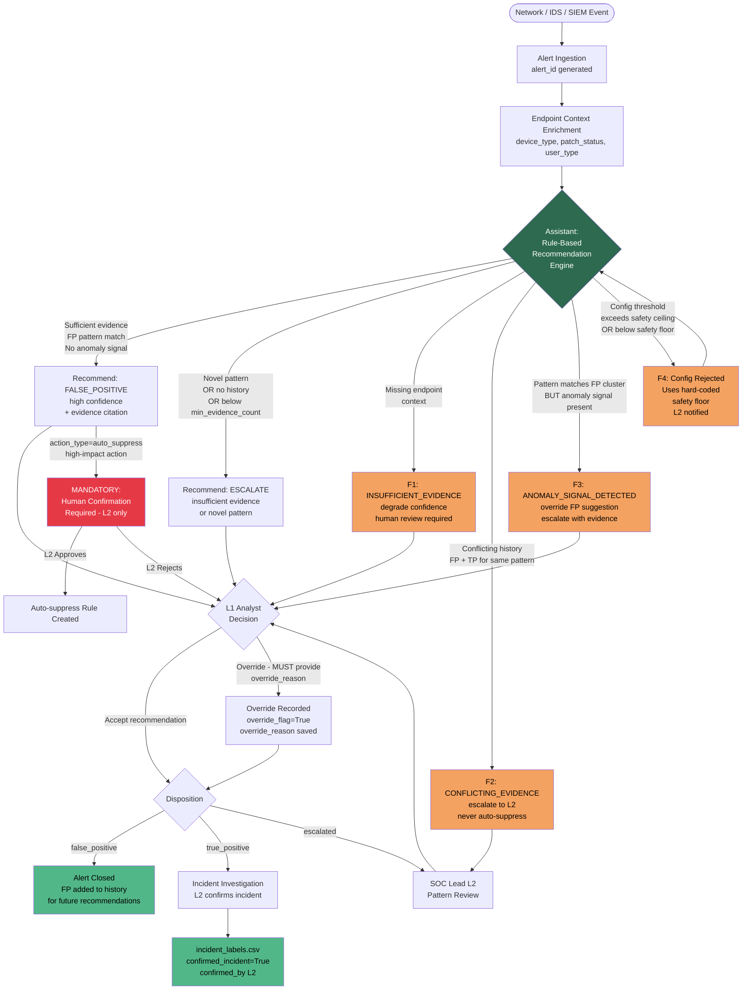

# User & Workflow Map: False-Positive Reduction Assistant for University SOC

**Course:** C28 — AI Immersion (Semester 5)  
**Document Version:** 1.0 (Phase 1)  
**Date:** 2026-09-03

---

## 1. University Network Segments — Distinct Populations with Distinct Baselines

The network is logically partitioned into four segments, each with its own "normal behaviour" profile that directly determines what constitutes a false positive on that segment.

| Segment | Population | Normal Behaviour Profile | Dominant FP Sources | Alert Volume Estimate | Typical TP Base Rate |
|---|---|---|---|---|---|
| **Student** | ~8,000 enrolled students; registered devices | High peer-to-peer traffic, streaming, BYOD device churn, occasional port scans from curiosity or coursework tools | P2P traffic signatures, port-scan alerts from Nmap/Wireshark exercises, SSH brute-force from misconfigured clients | High (~150/day) | ~10% |
| **Guest** | Walk-in visitors, conference attendees; ephemeral | Very high DHCP churn (devices connect/disconnect frequently), captive-portal redirect loops, DNS flooding from multiple lookups on connect | DHCP exhaustion alerts, DNS_FLOOD signatures, ARP spoofing from captive-portal | Very high (~200/day) | ~5% |
| **Lab** | Research staff, postgraduates running experiments | Automated/scripted traffic — network scanners, fuzzing tools, traffic generators are *expected* in lab environments | Port-scan signatures from legitimate scanners, IDS triggers from penetration-testing tools used in coursework | Medium (~30/day) | ~20% |
| **Admin** | Administrative systems: HR, finance, registrar, CISO office | Low volume, business-hours only, stable device inventory, high data sensitivity | Abnormal-hours login alerts, failed-auth from self-service resets | Low (~20/day) | ~60% |

**Design Rationale for Segment Distinction:**  
The recommendation engine must treat the same `alert_type` differently depending on which segment it originates from. A `PORT_SCAN` alert from the Lab segment has a high prior probability of being a false positive (automated research tool); the same alert from the Admin segment has a high prior probability of being a true positive (attacker doing reconnaissance on high-value targets). Hard-coding a single global rule for `PORT_SCAN` would be wrong — the context (segment + endpoint details) is load-bearing in the recommendation.

---

## 2. Role Definitions

### 2.1 L1 Analyst (Tier-1 SOC)

**Responsibilities:**
- Receives alerts in queue ordered by severity × staleness
- Reviews alert details, endpoint context, and assistant recommendation
- Accepts or overrides the recommendation
  - If overriding: **must provide an override reason** (enforced by API, not optional)
- Dispositions the alert as: `false_positive`, `true_positive`, or `escalated`
- Cannot modify configuration rules
- Cannot approve high-impact auto-actions (escalated to SOC Lead)

**Permissions:**
- `GET /alerts` — list/filter own queue
- `GET /alerts/{id}/recommend` — view recommendation + evidence
- `POST /alerts/{id}/disposition` — submit decision
- `GET /roles/l1_analyst/view` — role-scoped dashboard

### 2.2 SOC Lead (L2)

**Responsibilities:**
- Reviews L1 override patterns (are analysts frequently disagreeing with the assistant? Why?)
- Tunes configurable rules and thresholds (`config/rules.yaml`)
- Approves any high-impact auto-action (auto-suppression of an alert type) — cannot be delegated to L1
- Sees aggregate metrics: total alerts, FP rate, override rate, missed incident estimate
- Escalation destination for `escalated` dispositions from L1

**Permissions (superset of L1):**
- All L1 endpoints
- `GET /config/rules` — read current rule configuration
- `PUT /config/rules` — update rule thresholds (without code change)
- `GET /roles/soc_lead/view` — includes override-audit view, aggregate metrics, escalation queue
- Approval workflow for high-impact actions

---

## 3. SOC Workflow: End-to-End with Assistant Insertion Points

### 3.1 Normal Flow (No Edge Cases)

```
Network / IDS / SIEM
        │
        ▼ Alert event generated
┌───────────────────┐
│   Alert Ingestion  │  ← alert_id, timestamp, segment, type, severity, IPs,
│   (Database store) │    signature, raw_score stored to alerts.csv / DB
└───────────────────┘
        │
        ▼
┌───────────────────────┐
│  Endpoint Context      │  ← device_type, OS, patch_status, is_managed,
│  Enrichment Layer      │    user_type, known_vuln_count joined from endpoint_context
└───────────────────────┘
        │
        ▼
┌─────────────────────────────────────────────────────┐
│  ASSISTANT: Rule-Based Recommendation Engine         │  ← Phase 1
│  (Phase 2: ML model replaces/augments this)          │
│                                                       │
│  Logic:                                               │
│  1. Look up (alert_type, source_segment) in          │
│     historical analyst_decisions                      │
│  2. Compute FP rate for that pattern                  │
│  3. Check endpoint anomaly signals                    │
│  4. Apply config rules (thresholds from rules.yaml)   │
│  5. Produce: recommendation + confidence + evidence   │
│     + requires_human_confirmation flag                │
└─────────────────────────────────────────────────────┘
        │                         │
        │ Sufficient evidence      │ Insufficient evidence OR
        │ + below miss-rate        │ novel pattern OR
        │ ceiling                  │ anomaly signal detected
        ▼                         ▼
┌───────────────┐        ┌──────────────────────┐
│ Recommend: FP │        │ Recommend: ESCALATE  │
│ (high conf.)  │        │ (insufficient evid.) │
│               │        │ OR flag for L2        │
└───────────────┘        └──────────────────────┘
        │
        ▼ L1 Analyst Reviews
┌──────────────────────────────────────────┐
│  L1 Analyst Decision Point               │
│                                           │
│  Option A: Accept recommendation         │
│    → disposition = assistant_suggestion  │
│                                           │
│  Option B: Override recommendation       │
│    → MUST enter override_reason (enforced│
│      by API — 400 error if missing)      │
│    → override_flag = True recorded       │
└──────────────────────────────────────────┘
        │                         │
        ▼ Disposition = FP        ▼ Disposition = TP or Escalated
┌────────────────┐        ┌──────────────────────┐
│ Alert closed   │        │ Incident Investigation│
│ FP recorded    │        │ begins                │
│ to history for │        │                        │
│ future learning│        │ Confirmed by L2?       │
└────────────────┘        │  → incident_labels.csv │
                          └──────────────────────┘
```

### 3.2 High-Impact Action Path (Auto-Suppression Request)

```
Assistant computes: pattern confidence > auto_suggest_threshold
AND action_type = "auto_suppress" (flagged as high-impact in rules.yaml)
        │
        ▼
┌────────────────────────────────────────────┐
│  MANDATORY: Human Confirmation Required    │
│  → Notification sent to SOC Lead (L2)     │
│  → L1 CANNOT approve auto-suppression     │
│  → Alert stays open until L2 approves/     │
│    rejects                                  │
└────────────────────────────────────────────┘
        │                    │
        ▼ L2 Approves        ▼ L2 Rejects
┌──────────────┐     ┌──────────────────────┐
│ Auto-suppress│     │ Return to L1 queue   │
│ rule created │     │ with L2 note          │
└──────────────┘     └──────────────────────┘
```

---

## 4. Failure State Branches

```
Normal flow
    │
    ├─── F1: Missing endpoint context
    │         ↓ endpoint_context record absent for this alert_id
    │         Assistant flags: "INSUFFICIENT_EVIDENCE"
    │         Confidence degraded to low tier
    │         Recommendation: HUMAN_REVIEW_REQUIRED
    │         Alert NOT auto-closed (safety default)
    │
    ├─── F2: Conflicting analyst history
    │         ↓ same (alert_type, segment) pattern has BOTH FP and TP
    │           dispositions in history above conflict_threshold
    │         Assistant flags: "CONFLICTING_EVIDENCE"
    │         Recommendation: ESCALATE (never suggest suppression)
    │         L2 notified for pattern review
    │
    ├─── F3: Novel pattern masquerading as known FP
    │         ↓ pattern matches known FP cluster (alert_type + segment)
    │           BUT endpoint context shows anomaly signal:
    │           - device is unpatched (known_vuln_count > 0)
    │           - OR device is in admin segment (not student/guest)
    │           - OR device is unmanaged
    │         Assistant overrides FP suggestion → "ANOMALY_SIGNAL_DETECTED"
    │         Evidence includes: "Pattern matches FP cluster BUT [signal]
    │           was absent in 95% of historical FP cases"
    │         Recommendation: ESCALATE
    │
    └─── F4: Extreme config pushes confidence above safety ceiling
              ↓ config/rules.yaml sets auto_suggest_threshold = 0.99
                (near-perfect certainty required — effectively disabling automation)
              OR if config sets it BELOW hard_coded_safety_floor (0.60)
              System rejects the config value, logs a warning, uses floor value
              SOC Lead notified: "Config rejected — below safety floor"
              (This floor is INTENTIONALLY hard-coded as a non-configurable
               guardrail — documented explicitly in code comments)
```

---

## 5. Mermaid Workflow Diagram



---

## 6. Data Flow Map

```
alerts.csv ──────────────────────────────────────────┐
                                                       │
endpoint_context.csv ─── JOIN on alert_id ──────────► Recommendation Engine
                                                       │
analyst_decisions.csv ── historical lookup ──────────┘
(previous dispositions for same pattern)

Recommendation Engine ──► API response ──► L1 Analyst UI
                      ──► override_log ──► analyst_decisions.csv (new row)
                      ──► incident_labels.csv (if TP confirmed)
                      ──► SOC Lead audit view (override patterns)
```

---

## 7. Role-Permission Matrix

| Endpoint / Action | L1 Analyst | SOC Lead (L2) |
|---|---|---|
| `GET /alerts` (own queue) | ✓ | ✓ |
| `GET /alerts` (all alerts) | ✗ | ✓ |
| `GET /alerts/{id}/recommend` | ✓ | ✓ |
| `POST /alerts/{id}/disposition` | ✓ | ✓ |
| `GET /config/rules` | ✗ | ✓ |
| `PUT /config/rules` | ✗ | ✓ |
| `GET /roles/l1_analyst/view` | ✓ | ✓ |
| `GET /roles/soc_lead/view` | ✗ | ✓ |
| Approve auto-suppression | ✗ | ✓ |
| View override audit log | ✗ | ✓ |

---

*End of Workflow Map Document*
