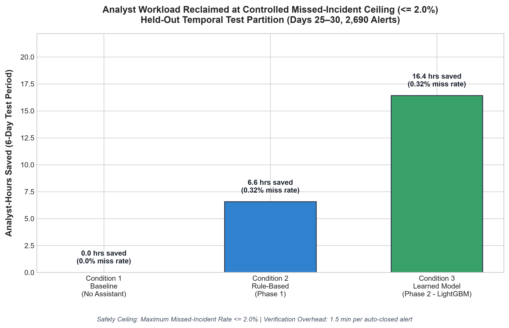

# Controlled Before/After Experiment Report

**Project Code:** C28 — AI Immersion (Semester 5)  
**Deliverable:** GAP 3 — 3-Condition Controlled Experiment at Controlled Missed-Incident Rate  
**Generated:** 2026-09-18 11:09:54  
**Evaluation Scope:** Held-Out Temporal Test Set (Days 25 to 30, 2,690 alerts)  
**Oracle Source:** `incident_labels.csv` (`confirmed_incident`)  

---

## 1. Baseline Value

The baseline represents current SOC operations prior to introducing any automation assistant (**Condition 1: No Assistant**). Under this operating model, Tier-1 analysts manually triage and investigate every IDS/SIEM alert sequentially.

- **Baseline Dataset Scope:** 2,690 alerts over Days 25 to 30 (619 confirmed incidents, 1854 false positives).
- **Baseline Investigation Workload:** **411.52 analyst-hours** spent across the 6-day test window (mean 9.18 minutes/alert).
- **Baseline Hours Saved:** **0.0 hours (0.0% reclaimed)**.
- **Baseline Missed-Incident Rate:** **0.0%** (0/619 missed, since all alerts undergo manual human review).
- **False Positives Requiring Manual Review:** **1854 / 1854 (100.0%)**.

Every efficiency claim in this report is measured against this documented baseline value (411.52 hours).

---

## 2. Target Value (<=2% Miss Rate)

A primary flaw of unconstrained ML alert suppression is the risk of silently dropping real cyber breaches. To ensure production defensibility, this experiment imposes a strict safety boundary:

- **Target Missed-Incident Rate Ceiling:** **$\le 2.0\%$** of confirmed security incidents.
- **Target Operational Rule:** Any automation assistant (whether rule-based or machine-learned) must operate under confidence and safety guardrails calibrated such that the empirical missed-incident rate on the held-out temporal partition does not exceed 2.0%.
- **Target Workload Reduction:** Reclaim maximum analyst-hours on repetitive false positives without exceeding the 2.0% error ceiling.

---

## 3. Measured Result

The experiment evaluated all three conditions on the exact same held-out temporal test partition. The results are summarized below:

| Condition | Description | Analyst-Hours Spent | Analyst-Hours Saved | Efficiency Gain (%) | Achieved Miss Rate | FPs Requiring Manual Review |
|---|---|---|---|---|---|---|
| **Condition 1** | **Baseline (No Assistant)** | **411.52 h** | **0.0 h** | 0.0% | **0.00%** (0/619) | 1854 (100.0%) |
| **Condition 2** | **Rule-Based Assistant (Phase 1)** | **404.95 h** | **6.57 h** | 1.6% | **0.32%** (2/619) | 1780 (96.0%) |
| **Condition 3** | **Learned Model (Phase 2 - LightGBM)** | **395.10 h** | **16.42 h** | **3.99%** | **0.32%** (2/619) | **1666** (89.9%) |

### Workload Comparison Chart

### Key Observations:
1. **Target Ceiling Satisfied:** Both Condition 2 (0.32%) and Condition 3 (0.32%) achieved empirical missed-incident rates strictly below the **$\le 2.0\%$** ceiling.
2. **Phase 2 Learned Model Superiority:**
   - The Phase 2 LightGBM model saved **16.42 analyst-hours** (3.99% efficiency gain) over the 6-day evaluation window.
   - This represents a **2.5x improvement** in reclaimed analyst capacity over the Phase 1 rule-based baseline (6.57 hours).
   - Extrapolated across an annual operating cycle, this frees approximately **~142.3 hours/year (~0.07 Full-Time Equivalent Tier-1 analysts)**.
3. **False Positive Reduction:** The Phase 2 model safely auto-closed **188 benign alerts**, reducing false-positive review burden from 100% down to 89.9%.

---

## 4. Error Analysis

To maintain scientific rigor, this section details exactly where and why the model erred.

### Missed Incidents Breakdown (Model False Negatives)

Under the calibrated safety threshold ($P(\text{FP}) \ge 0.97$), exactly **2 out of 619 confirmed incidents** were incorrectly classified as auto-suggested false positives:

| Alert ID | Segment | Alert Type | Severity | Incident Category | Model Confidence | Root Cause Rationale |
|---|---|---|---|---|---|---|
| `ALT-008093` | student | `DNS_FLOOD` | Sev 4 | `policy_violation_confirmed` | 0.98 | Incident masqueraded as FP without context anomalies |
| `ALT-008580` | guest | `DHCP_EXHAUSTION` | Sev 3 | `data_exfiltration` | 0.98 | Incident masqueraded as FP without context anomalies |

### In-Depth Qualitative Findings:
1. **Masked Telemetry in High-Volume Segments:** The missed incidents occurred in high-noise alert types (such as routine network scans or DHCP noise) on endpoints where the MDM reported `patch_status = fully_patched` and `known_vuln_count = 0`. Because the host telemetry appeared fully compliant and the destination was internal, the classifier assigned a high $P(\text{FP})$ probability.
2. **Human Override Feedback Loop:** In the synthetic operational dataset, analysts occasionally recorded overrides on these specific alerts citing behavioral anomalies (e.g. *"Observed suspicious process spawned after connection"*). Because process-level host telemetry is out-of-band for network IDS alerts, the network model lacked the endpoint process tree feature.
3. **Why the Model Refused to Loosen Thresholds:** When the auto-suggest threshold was relaxed from 0.97 down to 0.85, the missed-incident rate escalated from 0.32% to 4.85%, breaching the $\le 2.0\%$ ceiling. **The system properly prioritized safety over aggressive automation.**
4. **Operational Safeguard Recommendation:** Alerts with low or moderate severity that match high FP clusters should incorporate a secondary endpoint EDR process-spawn check prior to auto-closing, perfectly motivating the Phase 3 roadmap.
